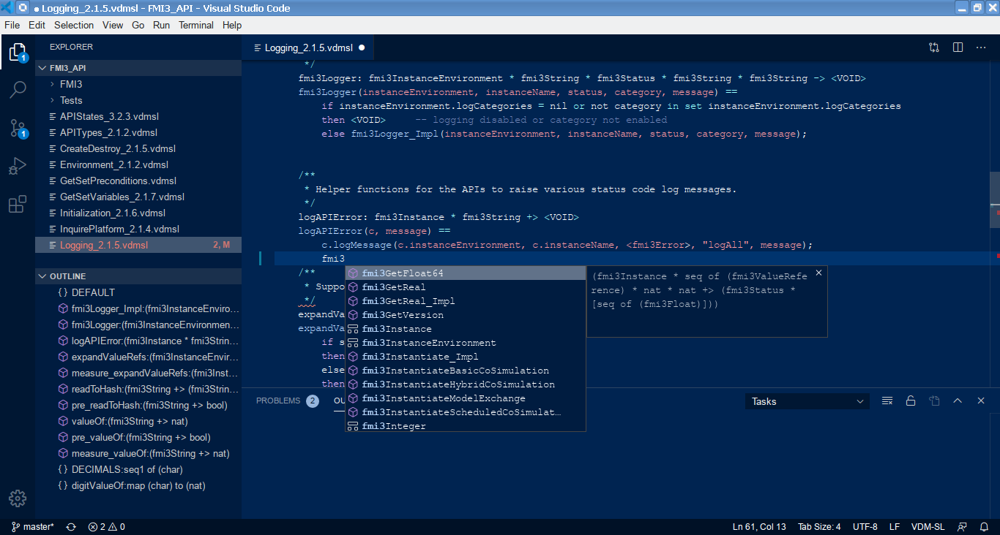

# VDMJ LSP/DAP Server

This project contains a developmental LSP/DAP language server for the VDM dialects supported by VDMJ.
It is intended to work with the VS Code IDE client, but it should also work with `lsp4e` in Eclipse.
The testing has focused on VS Code.

## Installation

Firstly, install VS Code itself. See [https://code.visualstudio.com/](https://code.visualstudio.com/). 

When this project is finished, the LSP/DAP server and the VS Code clients will be combined into complete
extensions and made available via the extensions Marketplace. But while the project is under test,
the two parts - the dialect clients and the LSP/DAP server - must be installed manually, as follows:

- Obtain the ZIP of **debug** VDM VS Code clients (see @nickbattle)
- Unzip the three clients directly into the .vscode/extensions folder of your installation.

To install the LSP/DAP server, either extract the VDMJ Github repository and "mvn clean install" at the
top level, or obtain the following jars from the VDMJ [Releases](https://github.com/nickbattle/vdmj/releases/tag/4.3.0-1) page.

- `vdmj-4.3.0-<date>.jar`
- `annotations-1.0.0-<date>.jar`
- `annotations2-1.0.0-<date>.jar`
- `lsp-0.0.1-SNAPSHOT-<date>.jar`

The LSP/DAP server is executed by starting Java with these four jars. The annotations jars are optional, but useful. The main class is lsp.LSPServerSocket.

`Usage: LSPServerSocket [-vdmsl | -vdmpp | -vdmrt] -lsp <port> -dap <port>`

Note that one VDM dialect **must** be passed, along with the listening port for the LSP and DAP protocols. For example:

`java -cp <jars> lsp.LSPServerSocket -vdmsl -lsp 8000 -dap 8001`

Optionally, `-Dlog.filename=/some/file.log` may be specified to log server activity. This is recommended!

## Editing VDM Specifications

The easiest way to use the LSP server is to start the server (above), **before** starting VS Code. Strictly, the
IDE does not need the server until a file is opened, but since VS Code remembers the open files from your last
session, it usually needs the server immediately. If the server is not available, VS Code will log the error and
then **stop talking to the server**. So the only option is to exit the IDE and restart it **after** starting the
server.

The LSP server uses VS Code folders rather than multi-root workspaces.

To start a new project folder, open VS Code and `Open Folder...` from the File menu. You can create a new folder,
or open an existing one. The server will treat **all** files in the folder and subfolders (recursively) as part of
the same specification, as long as the files match the file extension for the chosen dialect (eg. `*.vdmsl`, `*.vdmpp` or `*.vdmrt`). Other files in the folder will be ignored.

File and folder creation and deletion, moving and so on should work correctly.

Syntax errors are displayed for the file being edited as you type; the whole specification is type-checked when you
save a file.

The F12 key will navigate from a symbol name to its definition (eg. from a function call to its definition).

Typing a "." after a record variable will offer field names to complete the expression. Typing CTRL-SPACE will offer
global names with which to complete the name you are typing.

If you **close** the project folder or open a new one, the LSP server will be **told to shutdown**, so it will need to be restarted.

## Execution

To evaluate expressions against the specification for debugging, open the `Run...` panel. Initially, if there is
no `.vscode/launch.json` file in your folder, you will be prompted to create one. Select the `VDM Debug`
confguration; the default settings can be accepted. You can then launch the interpreter using the "Run" menu,
or just by pressing F5. You cannot start the interpreter if there are type checking errors (warnings are ok).

The debug console opens and allows you to enter multiple expressions to evaluate:

```
*
* VDMJ VDM_SL Interpreter
* DEBUG enabled
*

Default module is DEFAULT
Initialized in 0.001 secs.
fac(10)
= 3628800
Executed in 6.105 secs.
1+1
= 2
Executed in 0.003 secs.

```
The default module or class can be changed by typing the name (eg. evaluate "A" to change the default to module A).

If breakpoints have been set, the evaluation will stop and can be single stepped (over, in, out) or continued,
stack frames and values viewed and watched, using standard VS Code controls. Multi-threaded VDM++ debugging should
work correctly.

CTRL-F5 launches a session with debugging disabled (breakpoints will be ignored).

You can modify a specification while debugging, but the changes you make will not take effect until you start a
new debug session. You will be given an error if you attempt a new expression evaluation without a restart.

There are some screenshots below.

## Problems

Various things do not work perfectly yet:

- The F12 navigation does not work correctly for a few expressions that involve types. For example, you cannot
navigate to the `Clock` definition in the expression `is_(var, Clock)`. But most common type usage is OK,
like record field definitions or function signatures.
- The "." field completion is awkward to use because it requires the spec to be type-checked. So if you type
`var.field`, the field part will not be offered unless you type `var`, then save the spec to type check it, and
then type ".".
- If you click the `Stop` (Shift-F5 or the red square) debugging button, the session is usually closed and the debug
console says so. But if you click `Stop` at a breakpoint or an exception that has been caught, control returns to the debug
console and the session is still active. Clicking `Stop` once again will stop for real.
- If the LSP server gets confused, the best way forward is to stop the IDE and server, restart the server and restart
the IDE. VS Code remembers where you were and you are unlikely to lose work.
- The `log.filename` output is quite verbose, so be careful about log file sizes. Note that (on Linux systems)
you can set the filename to `/dev/tty` to just spool to the terminal.


For more information or if you have problems, contact @nickbattle.




