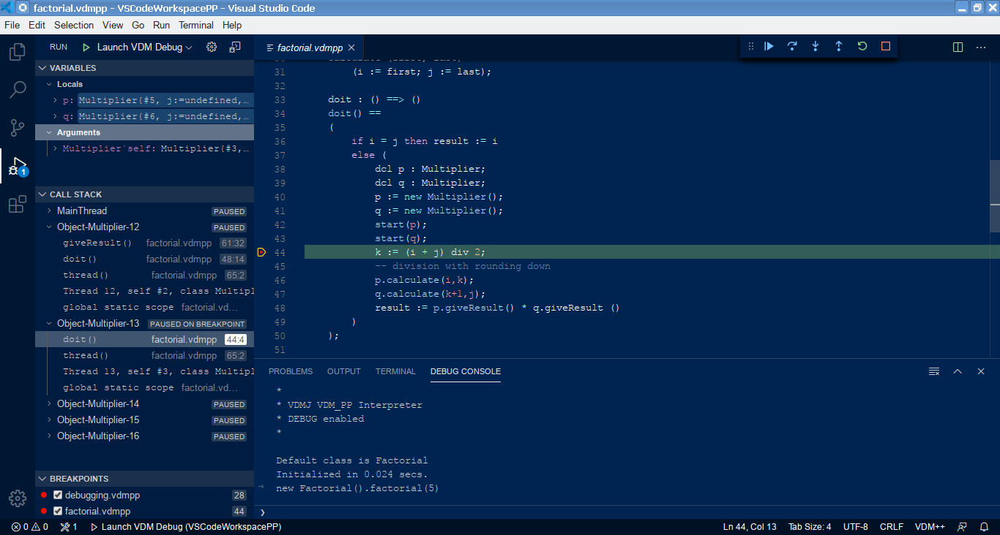

# VDMJ LSP/DAP Server

This project contains a LSP/DAP language server for the VDM dialects supported by VDMJ.
It is intended to work with the VS Code IDE client, but it should also work with `lsp4e` in Eclipse.
The testing has focused on VS Code.

## Installation

Firstly, install VS Code itself. See [https://code.visualstudio.com/](https://code.visualstudio.com/). 

Secondly, search for and install the "VDM VSCode" extension via the VS Code extensions panel (id "jonaskrask.vdm-vscode").


## Editing VDM Specifications

To start a new project folder, open VS Code and `Open Folder...` from the File menu. You can create a new folder, or open an existing one. The server will treat **all** files in the folder and subfolders (recursively) as part of the same specification, as long as the files match the file extension for the chosen dialect (ie. `*.vdmsl`, `*.vdmpp` or `*.vdmrt`). Other files in the folder will be ignored.

Once a folder has been created, it can be saved as a "workspace" and more folders added subsequently.

Most standard VS Code actions should work, but note:

- Syntax errors are displayed for the file being edited as you type; the whole specification is type-checked when you save a file.

- The F12 key will navigate from a symbol name to its definition (eg. from a function call to its definition).

- Typing a "." after a record variable will offer field names to complete the expression. Typing CTRL-SPACE will offer global names with which to complete the name you are typing.

- Standard VDMJ annotations should work as expected (and you can include your own, see below).

## Settings

Various settings are available, and these can be set on a user, workspace or folder basis in the usual way:

- The standard VDMJ annotations are available by default, but you can add your own via the annotation path setting.
- The High Precision setting enables VDMJ's high precision real arithmetic mode.
- The JVM arguments setting allows any extra arguments to be passed to the LSP server.
- Server logging can be enabled for investigating problems.
- The "experimental server" setting allows an external LSP/DAP server to be debugged.

## Execution

To evaluate expressions against the specification for debugging, open the `Run...` panel. Initially, if there is
no `.vscode/launch.json` file in your folder, you will be prompted to create one. Select the `VDM Debug`
confguration; the default settings can be accepted. You can then launch the interpreter using the "Run" menu,
or just by pressing F5. You cannot start the interpreter if there are type checking errors (warnings are ok).

The debug console opens and allows you to enter multiple expressions to evaluate:

```
*
* VDMJ VDM_SL Interpreter
* DEBUG enabled
*

Default module is DEFAULT
Initialized in 0.001 secs.

print fac(10)
= 3628800
Executed in 0.005 secs.

p 1+1
= 2
Executed in 0.003 secs.

```

The launch.json file has an optional "command" setting. If set, the interpreter will execute that one command and then exit. So for example, "print main(1,2,3)" will automatically execute that one call.

If breakpoints have been set, the evaluation will stop and can be single stepped (over, in, out) or continued,
stack frames and values viewed and watched, using standard VS Code controls. Multi-threaded VDM++ debugging should
work correctly.

CTRL-F5 launches a session with debugging disabled (breakpoints will be ignored).

You can modify a specification while debugging, but the changes you make will not take effect until you start a
new debug session. You will be given an error if you attempt a new expression evaluation without a restart.

There are some screenshots below.

## Combinatorial Testing

A combinatorial testing panel is available (the icon is a circle with CT inside). Tests can be generated from traces, filtered and executed individually. Hopefully the interface is intuitive, but note that to change project you have to "refresh" the trace - you will be offered a list of projects to select.

## Proof Obligations

Right-click on a file and select "Run Prof Obligation Generation". This will create obligations, display them and allow you to navigate into the specification.

## Translations

Two options are available to translate VDM source into LaTeX or Word formats. Right-click on a file and the generated sources will appear in the ".generated" folder within the project.

## Problems

Various things do not work perfectly yet:

- The F12 navigation does not work correctly for a few expressions, but most common type usage is OK, like record field definitions or function signatures.
- The "." field completion is awkward to use because it requires the spec to be cleanly type-checked. So if you type `var.field`, the field part will not be offered unless you type `var`, then save the spec to type check it, and then type ".".
- If you click the `Stop` (Shift-F5 or the red square) debugging button, the session is usually closed and the debug console says so. But if you click `Stop` at a breakpoint or an exception that has been caught, control returns to the debug console and the session is still active. Clicking `Stop` once again will stop for real.


For more information or if you have problems, contact @nickbattle.




